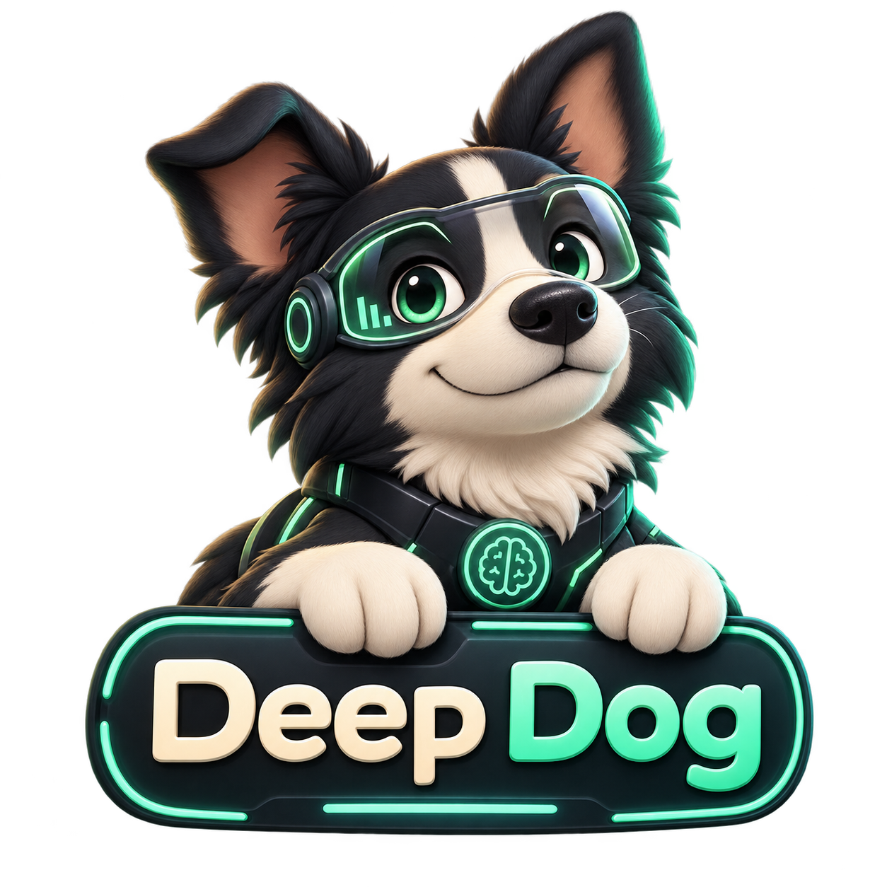

<p align="center">
  
</p>

<h1 align="center">Deep Dog Agent</h1>

<p align="center">
  Un agente di ricerca profonda che trasforma una domanda in un report documentato, con fonti, esportazione Markdown e PDF.
</p>

Deep Dog pianifica la ricerca, affida domande mirate ad agenti specializzati, consulta il web, raccoglie le fonti e genera un report ordinato. Questa versione include un'interfaccia web locale pensata per Windows e non richiede Docker.

> [!IMPORTANT]
> Deep Dog viene eseguito sul tuo PC, ma la ricerca non è offline: modello e motori di ricerca comunicano con le API selezionate. La creazione dell'interfaccia, la gestione del report e la generazione del PDF avvengono localmente.

## Indice

- [Funzioni](#funzioni)
- [Come funziona](#come-funziona)
- [Requisiti](#requisiti)
- [Installazione su Windows](#installazione-su-windows)
- [Configurazione delle API](#configurazione-delle-api)
- [Avvio](#avvio)
- [Eseguire una ricerca](#eseguire-una-ricerca)
- [Modalità veloce e approfondita](#modalità-veloce-e-approfondita)
- [Scaricare il report](#scaricare-il-report)
- [Sicurezza e privacy](#sicurezza-e-privacy)
- [Risoluzione dei problemi](#risoluzione-dei-problemi)
- [Struttura del progetto](#struttura-del-progetto)
- [Licenza e attribuzioni](#licenza-e-attribuzioni)

## Funzioni

- ricerca multi-agente con fonti e citazioni;
- DeepSeek diretto oppure modelli disponibili tramite OpenRouter;
- ricerca web con Exa, Tavily o entrambi;
- profilo **Demo veloce** e profilo **Approfondita**;
- avanzamento della ricerca mostrato nell'interfaccia;
- pulsante rosso **Interrompi ricerca** durante l'esecuzione;
- comando **Nuova ricerca** per azzerare il lavoro precedente;
- download del risultato in Markdown;
- PDF impaginato localmente con copertina, titoli, tabelle, link e numerazione;
- configurazione senza Docker.

## Come funziona

```text
Domanda dell'utente
        │
        ▼
Definizione del piano di ricerca
        │
        ▼
Delega agli agenti specializzati
        │
        ├──► Ricerca web con Exa
        ├──► Ricerca web con Tavily
        └──► Altri agenti abilitati dal motore
        │
        ▼
Raccolta e verifica delle fonti
        │
        ▼
Sintesi del report finale
        │
        ├──► Download Markdown
        └──► Creazione PDF locale
```

Il supervisore decide quali aspetti approfondire e può avviare più attività di ricerca. I risultati vengono poi riuniti in un unico report con una sezione dedicata alle fonti.

## Requisiti

- Windows 10 o Windows 11;
- Python 3.11 o successivo;
- connessione Internet;
- una chiave per il modello: **DeepSeek** oppure **OpenRouter**;
- una chiave per la ricerca: **Exa** oppure **Tavily**;
- spazio libero per Python, dipendenze e report.

Una GPU dedicata non è richiesta: il modello viene raggiunto tramite API.

## Installazione su Windows

### Installazione automatica consigliata

Per la maggior parte degli utenti basta estrarre lo ZIP e fare doppio clic su:

```text
Avvia Deep Dog Web.bat
```

L'avviatore controlla automaticamente il computer e:

1. cerca Python 3.11 o superiore;
2. se Python manca, prova a installare Python 3.12 tramite `winget`;
3. crea l'ambiente isolato `.venv` se non esiste;
4. aggiorna `pip`;
5. installa soltanto le dipendenze mancanti o non aggiornate;
6. avvia Deep Dog e apre il browser.

Al primo avvio è necessaria una connessione Internet e l'operazione può richiedere alcuni minuti. Gli avvii successivi riutilizzano l'ambiente già creato. Se `winget` non è disponibile, l'avviatore mostra il link per installare Python manualmente.

### Installazione manuale

#### 1. Scarica il progetto

Premi **Code → Download ZIP** su GitHub ed estrai l'archivio. In alternativa, se utilizzi Git:

```powershell
git clone https://github.com/techtonic2025/Deep-Dog-Agent.git
cd Deep-Dog-Agent
```

#### 2. Crea l'ambiente Python

Apri PowerShell nella cartella del progetto:

```powershell
python -m venv .venv
```

Se il comando `python` non viene trovato, installa Python 3.11 o una versione successiva e abilita l'opzione per aggiungerlo al `PATH`.

#### 3. Installa le dipendenze

Non è necessario attivare manualmente l'ambiente:

```powershell
.venv\Scripts\python.exe -m pip install --upgrade pip
.venv\Scripts\python.exe -m pip install -r requirements.txt
```

L'installazione iniziale può richiedere alcuni minuti.

## Configurazione delle API

Puoi configurare tutto direttamente dall'interfaccia. Le combinazioni minime sono:

| Funzione | Scelta 1 | Scelta 2 |
|---|---|---|
| Modello AI | DeepSeek API | OpenRouter API |
| Ricerca web | Exa API | Tavily API |

Non è necessario compilare tutti e quattro i campi. Per esempio, puoi usare **DeepSeek + Exa** oppure **OpenRouter + Tavily**.

### Configurazione dall'interfaccia

1. Avvia Deep Dog.
2. Premi **Configura** nel pannello Setup.
3. Incolla le chiavi nei campi corrispondenti.
4. Scegli il provider del modello.
5. Scegli Exa, Tavily oppure entrambi.
6. Seleziona la profondità.
7. Premi **Salva setup**.

Una voce verde **configurata** conferma che la relativa chiave è presente in memoria. Per sicurezza, Deep Dog non mostra nuovamente il valore della chiave.

### Configurazione facoltativa con `.env`

Copia `.env.example` e rinomina la copia in `.env`:

```dotenv
DEEPSEEK_API_KEY=
EXA_API_KEY=
OPENROUTER_API_KEY=
TAVILY_API_KEY=
```

Inserisci soltanto le chiavi che utilizzerai. Il file `.env` è già escluso da Git e non deve essere condiviso.

## Avvio

Fai doppio clic su:

```text
Avvia Deep Dog Web.bat
```

Oppure esegui manualmente:

```powershell
.venv\Scripts\python.exe web_app.py
```

Deep Dog apre automaticamente il browser all'indirizzo:

```text
http://127.0.0.1:8765/
```

`127.0.0.1` indica il computer locale: l'interfaccia non viene pubblicata su Internet.

## Eseguire una ricerca

1. Scrivi una domanda precisa nel campo principale.
2. Premi **Avvia ricerca**.
3. Segui gli aggiornamenti mostrati sotto i pulsanti.
4. Attendi la comparsa del report.
5. Scarica il formato desiderato.

Esempio di domanda:

```text
Confronta i cinque migliori strumenti open source per creare agenti AI su Windows.
Per ciascuno indica licenza, requisiti, difficoltà di installazione, punti di forza,
limiti e link alle fonti ufficiali. Concludi con una raccomandazione per principianti.
```

Una domanda dettagliata produce in genere un risultato più utile di una richiesta generica.

### Interrompere una ricerca

Durante l'esecuzione compare il pulsante rosso **■ Interrompi ricerca**. La cancellazione è cooperativa: l'attività in corso termina appena raggiunge un punto sicuro, quindi possono essere necessari alcuni secondi.

### Avviare una nuova ricerca

Al termine compare **＋ Nuova ricerca**. Il pulsante cancella dalla sessione il report precedente, gli eventi e gli eventuali errori, quindi riporta il cursore nel campo della domanda.

Aggiornare la pagina non cancella automaticamente il report. Questo comportamento evita di perdere accidentalmente un risultato prima del download.

## Modalità veloce e approfondita

| Profilo | Quando usarlo | Comportamento |
|---|---|---|
| Demo veloce | prove, video, domande semplici | meno risultati e limiti più stretti per ridurre l'attesa |
| Approfondita | confronti complessi e report completi | più tempo, più iterazioni e maggiore quantità di fonti |

I tempi reali dipendono dai provider, dalla complessità della domanda, dai limiti del piano API e dalla velocità della connessione.

## Scaricare il report

Quando è disponibile un risultato puoi scegliere:

- **Scarica .md**: testo Markdown leggero, facile da modificare;
- **Scarica PDF**: documento più leggibile, pronto da condividere.

Il PDF viene costruito sul computer con ReportLab. Comprende copertina con mascotte, domanda originale, titoli, paragrafi, elenchi, tabelle, link cliccabili, intestazione e numerazione delle pagine. Il file non viene inviato a un servizio esterno per la conversione.

## Sicurezza e privacy

- le chiavi inserite nel Setup restano nella memoria del processo;
- le chiavi non vengono mostrate nuovamente nell'interfaccia;
- `.env`, `.venv`, log, cache, database e report generati sono esclusi da Git;
- il server ascolta soltanto su `127.0.0.1`;
- domanda e contenuti necessari alla ricerca vengono inviati ai provider API selezionati;
- le pagine web vengono consultate tramite i motori di ricerca configurati.

Non inserire chiavi direttamente nei file Python. Se una chiave viene pubblicata accidentalmente, revocala dal pannello del provider e generane una nuova.

## Risoluzione dei problemi

### `OpenAIConnectionError: Connection error`

Controlla:

1. che la connessione Internet funzioni;
2. che la chiave corrisponda al provider selezionato;
3. che il credito o il piano API sia ancora attivo;
4. che firewall, antivirus o VPN non blocchino Python;
5. che l'indirizzo del provider sia raggiungibile.

Il nome dell'errore deriva dalla libreria compatibile con il protocollo OpenAI e non significa necessariamente che stai usando OpenAI.

### Setup non pronto

Verifica di avere almeno:

- una chiave valida per il modello selezionato;
- una chiave valida per il motore di ricerca selezionato.

Se scegli **Exa + Tavily**, configura entrambe le chiavi di ricerca.

### Il pulsante Interrompi non compare

Il pulsante è visibile soltanto mentre lo stato è `running`. Se il browser conserva una vecchia versione della pagina, premi `Ctrl+F5`.

### Il vecchio report resta dopo il refresh

È il comportamento previsto. Premi **Nuova ricerca** per azzerare la sessione corrente.

### La porta 8765 è già occupata

Chiudi eventuali vecchie finestre di Deep Dog o termina il precedente processo Python, quindi avvia nuovamente il file `.bat`.

### Il PDF non viene generato

Assicurati che l'installazione sia completa:

```powershell
.venv\Scripts\python.exe -m pip install -r requirements.txt
```

Il download PDF è disponibile soltanto quando esiste un report.

## Struttura del progetto

```text
Deep-Dog-Agent/
├── assets/web/                 # Mascotte e risorse dell'interfaccia
├── deep_research/              # Motore multi-agente
│   └── agents/                 # Agenti e strumenti specializzati
├── .env.example                # Nomi delle variabili, senza chiavi reali
├── .gitignore                  # Protezione dei file locali
├── Avvia Deep Dog Web.bat      # Avvio rapido per Windows
├── pdf_export.py               # Generazione locale del PDF
├── pyproject.toml              # Metadati e dipendenze Python
├── requirements.txt            # Installazione del progetto
└── web_app.py                  # Server locale e interfaccia web
```

## Aggiornamento

Se hai clonato il repository con Git:

```powershell
git pull
.venv\Scripts\python.exe -m pip install -r requirements.txt
```

Se hai scaricato lo ZIP, scarica la nuova versione e sostituisci la cartella, conservando separatamente l'eventuale file `.env`.

## Licenza e attribuzioni

Il progetto è distribuito con licenza MIT. Il file [LICENSE](LICENSE) contiene le attribuzioni del progetto originale **Deep Dog 2** di Benjamin Andrew Eadie e del progetto **ThinkDepth Deep Research** sul quale è basato.

Le attribuzioni e il testo della licenza devono essere conservati nelle copie o nelle versioni derivate.
